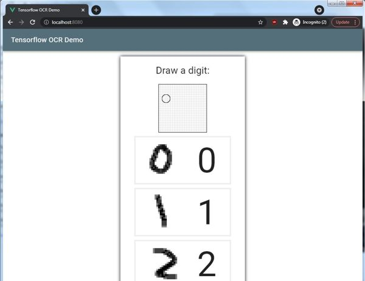

# Tensorflow OCR demo
A simple OCR test app using Tensorflow JS to recognize hand-drawn digits.
Draw a digit, the app will print it's interpretation of your digit.



## Project setup
```
npm install
```

### Compiles and hot-reloads for development
To run the dev server:
```
npm run serve
```
By default the dev server will listen on http://localhost:8080

### Compiles and minifies for production

To build for production:
```
npm run build
```
Build files will be stored in `./dist`.

### Customize configuration
See [Configuration Reference](https://cli.vuejs.org/config/).
